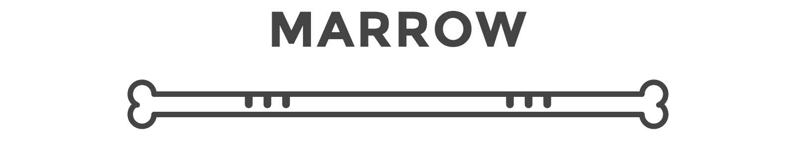

Lightweight and responsive UI components built with [Skeletor](https://github.com/rangle/skeletor).

## Development

1. Install dependencies:

  - `gem install sass`
  - `gem install scss-lint`
  - `npm install`

2. Gulp tasks available:

  - `sass`: compile Sass
  - `docs`: build the documentation
  - `scss-lint`: run the SCSS linter
  - `cssstats`: generates the css statistics
  - `dev`: start a simple node server, build docs and compile Sass

3. Go to [http://localhost:3000](http://localhost:3000) for the documentation
